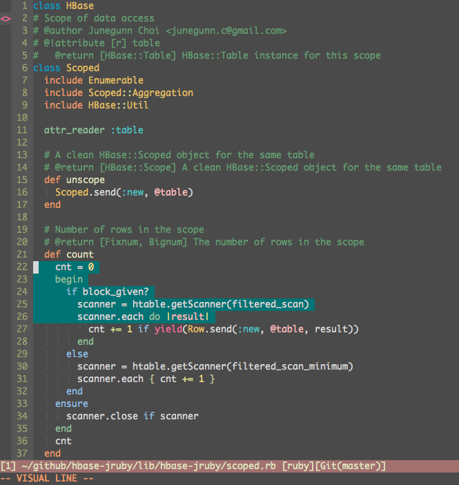

# minvim

minimal neovim config without the bloat.



## plugins

- **seoul256** - clean colorscheme
- **supermaven** - ai code completion
- **nvim-treesitter** - syntax highlighting
- **fzf-lua** - fuzzy file finding

## keybindings

| key | action |
|-----|--------|
| `<space><space>` | find files |
| `<space>/` | live grep |
| `gr` | grep word under cursor |

## structure

```
init.lua          # sensible defaults
lua/
  plugins.lua     # plugin setup
  mappings.lua    # keymaps
```

## install

```bash
git clone https://github.com/al3rez/minvim ~/.config/nvim
```